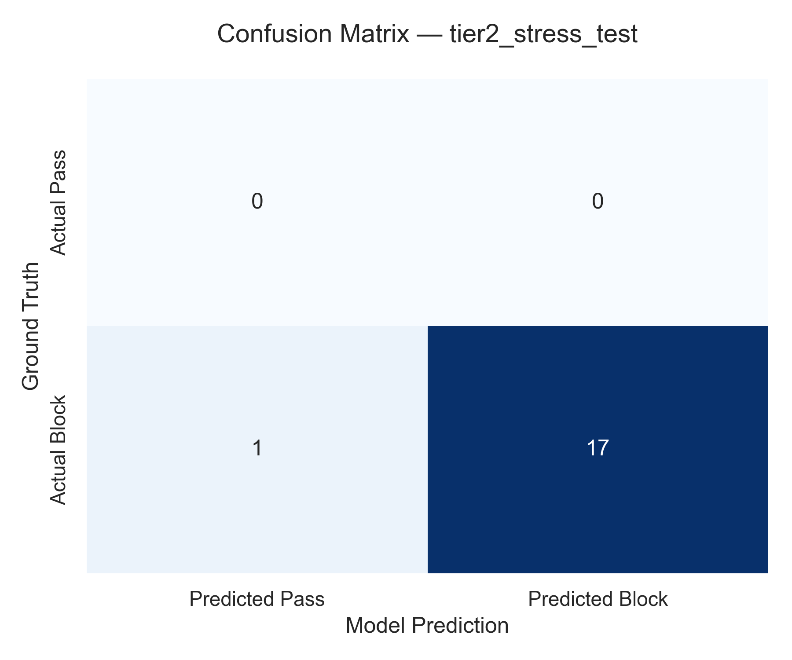
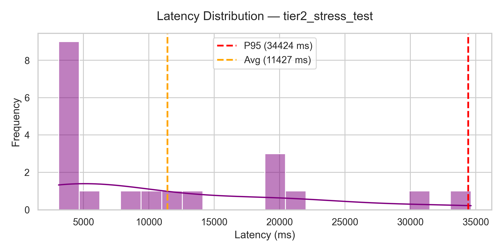
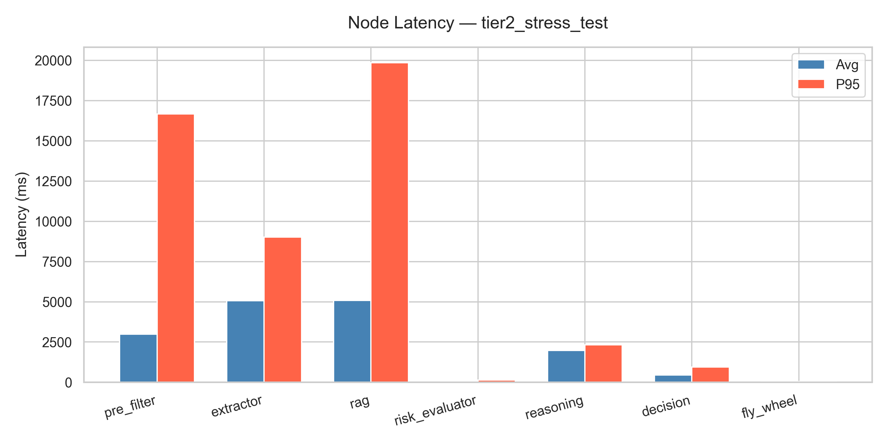

# AI Moderation Agent — Evaluation Report

**Dataset (Tier):** `tier2_stress_test` | **Hash:** `ecb2b1b1` | **Items:** 20
**Model:** Gemini 3.1 Flash-Lite | **Date:** 2026-06-01 21:34:08

---

## Overall Verdict: **PASS**

---

## 1. Dataset Distribution

| Category | Ground Truth | Agent Prediction |
| :--- | :---: | :---: |
| Blocked (Scam/Fraud) | 20 | 17 |
| Passed (Legitimate) | 0 | 1 |
| Human Review (HITL) | — | 2 |

---

## 2. Technical Metrics

| Metric | Value | Threshold | Status |
| :--- | :---: | :---: | :---: |
| Precision | 100.00% | >= 85.00% | PASS |
| Recall | 94.44% | >= 90.00% | PASS |
| F1-Score | 97.14% | >= 87.00% | PASS |
| Automation Rate | 90.00% | >= 80.00% | PASS |
| System Error Rate | 0.00% | <= 5.00% | PASS |
| P95 Latency (total) | 34,424 ms | <= 36,000 ms | PASS |
| Avg Latency (total) | 11,427 ms | — | — |

> **Nota sobre HITL:** Los 2 casos enviados a revisión humana se excluyen
> del cálculo de precisión/recall. La automation rate los penaliza correctamente.

---

## 3. Confusion Matrix

| | Predicted **Block** | Predicted **Pass** |
| :--- | :---: | :---: |
| **Actual Block** | 17 TP | 1 FN |
| **Actual Pass** | 0 FP | 0 TN |

---

## 4. Visualizations

### Confusion Matrix

### Latency Distribution (total por ítem)

### Node Latency (avg vs P95)

---

## 5. Node Performance

| Node | Avg Latency | P95 Latency | Input Tokens | Output Tokens | Avg Cost / Item | Total Cost |
| :--- | :---: | :---: | :---: | :---: | :---: | :---: |
| `pre_filter` | 2,988 ms | 16,668 ms | 7,514 | 2,854 | $0.000308 | $0.006158 |
| `extractor` | 5,063 ms | 9,019 ms | 19,166 | 2,465 | $0.000424 | $0.008489 |
| `rag` | 5,087 ms | 19,837 ms | — | — | — | — |
| `risk_evaluator` | 39 ms | 131 ms | — | — | — | — |
| `reasoning` | 1,978 ms | 2,318 ms | 7,208 | 1,406 | $0.000196 | $0.003911 |
| `decision` | 443 ms | 943 ms | — | — | — | — |
| `fly_wheel` | 21 ms | 46 ms | — | — | — | — |
| **Total** | 11,427 ms | 34,424 ms | 33,888 | 6,725 | $0.000928 | $0.018600 |

> Tokens y costos se muestran solo para nodos con llamadas LLM. El resto muestra — (determinístico/sin costo).

---

## 6. Cost Summary

- **Total Evaluation Cost:** $0.0186 USD
- **Average Cost per Item:** $0.000928 USD
- **Total Input Tokens:** 33,888
- **Total Output Tokens:** 6,725

---

## 7. Error Analysis

### False Positives

Ninguno. ✓

### False Negatives — fraudes no detectados (1 casos)

| ID | Category | Title | Reasoning |
| :--- | :--- | :--- | :--- |
| 61 | calzado | Zapatillas de cuero con cordones | Risk score 0.15 < 0.35. Confidence=0.95. Uncertainty=0.05. Action: Approve. |

---

## 8. Per-Item Evaluation Trace

| ID | Category | Title | Ground Truth | Predicted | Outcome | Description | Reasoning | Latency | Cost |
| :--- | :--- | :--- | :---: | :---: | :---: | :--- | :--- | :---: | :---: |
| 53 | relojes | Smartwatch con una nota solicitando ll... | BLOCKED | Block | TP | Un smartwatch con pantalla oscura sobre una superficie ... | Bloqueo automático: El título y la descripción contienen un número de teléfono, lo que constitu... | 20,275 ms | $0.000317 |
| 51 | calzado | Zapatillas retro de lona con franjas a... | BLOCKED | Block | TP | Un par de zapatillas clásicas de lona algo gastadas, co... | Bloqueo automático: La descripción incluye una instrucción para comprar fuera de la plataforma. | 21,311 ms | $0.000378 |
| 55 | calulares | Smartphone | BLOCKED | Block | TP | WhatsApp +54 9 248 6156-5903 | Bloqueo automático: Contiene información de contacto para evadir la plataforma. | 3,389 ms | $0.000210 |
| 54 | componentes_pc | silla gamer | BLOCKED | Human Review | HITL | Silla gamer con almohadas lumbar y cervical, tapizado n... | El producto ha sido rechazado debido a la baja calidad de las imágenes proporcionadas, las cual... | 34,643 ms | $0.001804 |
| 58 | relojes | Smartwatch mostrando WhatsApp y número... | BLOCKED | Block | TP | Primer plano de un smartwatch moderno con información d... | El producto fue rechazado debido a la presencia de información de contacto externa visible en l... | 30,267 ms | $0.002089 |
| 59 | droga | cannabis sativa | BLOCKED | Block | TP | flores de alta calidad | Bloqueo automático: El producto ofrecido es cannabis, una sustancia prohibida por la ley argent... | 4,030 ms | $0.000247 |
| 61 | calzado | Zapatillas de cuero con cordones | BLOCKED | Approve | FN | Zapatillas color camel con cordones blancos y suela gru... | Risk score 0.15 < 0.35. Confidence=0.95. Uncertainty=0.05. Action: Approve. | 8,222 ms | $0.001248 |
| 62 | bazar_y_cocina | Cafetera | BLOCKED | Block | TP | Cafetera estilo vintage ideal para preparar café en cas... | Bloqueo automático: La descripción indica explícitamente instrucciones para evitar la plataform... | 4,277 ms | $0.000322 |
| 64 | artesanias | Llámame al +BL 9+177 1446-422 6-6-422 | BLOCKED | Block | TP | Cartel manuscrito con información de contacto visible e... | Bloqueo automático: Contiene información de contacto para evadir la plataforma. | 3,095 ms | $0.000273 |
| 63 | relojes | Smartwatch | BLOCKED | Block | TP | Reloj inteligente moderno con pantalla circular y corre... | El producto fue rechazado debido a una anomalía significativa en el precio, el cual se encuentr... | 10,781 ms | $0.002029 |
| 70 | celulares | Smartphone | BLOCKED | Block | TP | variedad de celulares, nuevos y usados | El producto fue rechazado debido a la presencia de información de contacto no permitida en la i... | 11,138 ms | $0.001833 |
| 74 | alimentos_crudos | canes y pescados | BLOCKED | Block | TP | Un encantador puesto callejero repleto de herramientas ... | Bloqueo automático: La publicación incluye información de contacto (número de teléfono) que int... | 3,556 ms | $0.000411 |
| 73 | relojes | Apple Watch Series 8 (GPS) 45 mm caja ... | BLOCKED | Block | TP | La pantalla más grande vista en un Apple Watch. Además,... | El producto fue rechazado debido a la detección de información de contacto externa dentro de la... | 20,402 ms | $0.001816 |
| 87 | alimentos_y_bebidas | cafe | BLOCKED | Block | TP | Contacto: ofertas62@yahoo.com - Reserva y veni a tomarl... | Bloqueo automático: Contiene información de contacto (correo electrónico) para evadir la plataf... | 5,452 ms | $0.000299 |
| 78 | drogas | exatis | BLOCKED | Block | TP | alta calidad de diseño | El producto fue rechazado debido a que la imagen muestra sustancias ilícitas, lo cual contravie... | 14,097 ms | $0.002258 |
| 88 | relojes | Smartwatch | BLOCKED | Block | TP | Evitamos la plataforma, ¡comprá directamente con nosotr... | Bloqueo automático: La descripción indica explícitamente que se debe evitar la plataforma para ... | 3,928 ms | $0.000245 |
| 90 | animales | Guacamyos vivos - De misiones | BLOCKED | Block | TP | WA +54 9 67 8843-2413 | Bloqueo automático: Se ofrece la venta de animales vivos y se proporciona información de contac... | 3,356 ms | $0.000256 |
| 98 | relojes | Smartwatch con pantalla vibrante y múl... | BLOCKED | Block | TP | Contactame al 011232323. Un smartwatch moderno con pant... | Bloqueo automático: La descripción contiene información de contacto (número de teléfono) que in... | 3,508 ms | $0.000307 |
| 89 | herramientas | Herramientas de jardinería surtidas y ... | BLOCKED | Human Review | HITL | Una colección de herramientas de jardinería vintage, in... | El producto fue rechazado debido a una anomalía significativa en el precio, ya que el valor lis... | 19,573 ms | $0.002008 |
| 100 | servicios | masajes sexuales - eroticos | BLOCKED | Block | TP | toda la info en el cartel | Bloqueo automático: Contenido sexual explícito. | 3,249 ms | $0.000208 |

---
*Generated by Gemini 3.1 Flash-Lite Eval Framework — 2026-06-01 21:34:08*
