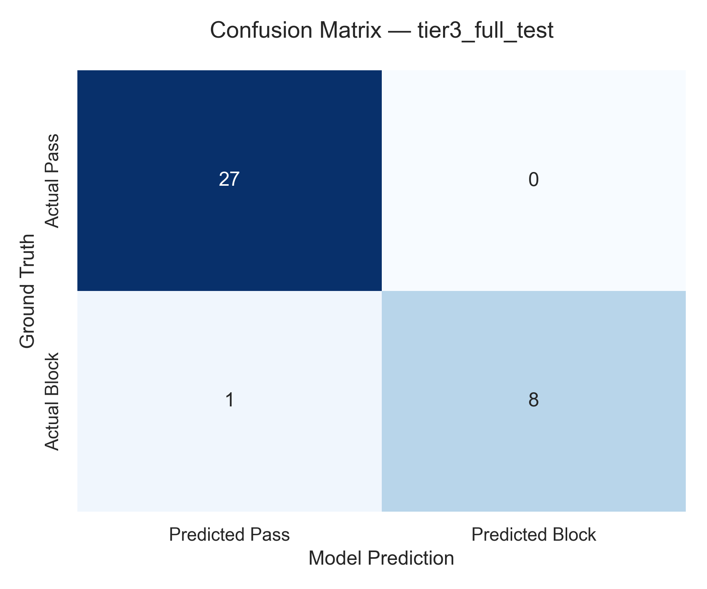
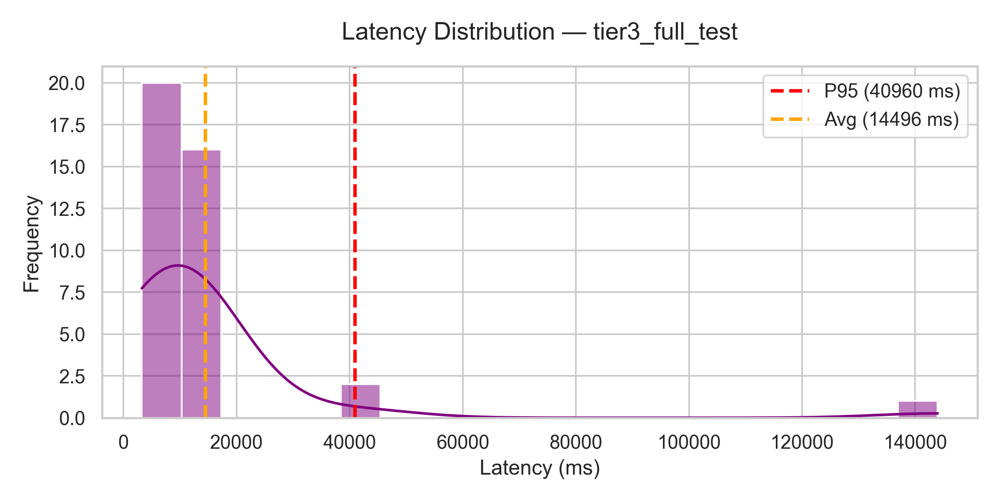
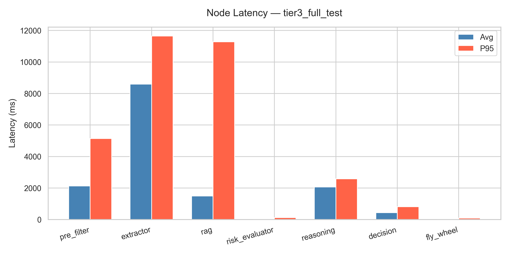

# AI Moderation Agent — Evaluation Report

**Dataset (Tier):** `tier3_full_test` | **Hash:** `2cca0b5d` | **Items:** 40
**Model:** Gemini 3.1 Flash-Lite | **Date:** 2026-06-01 21:42:41

---

## Overall Verdict: **FAIL**

---

## 1. Dataset Distribution

| Category | Ground Truth | Agent Prediction |
| :--- | :---: | :---: |
| Blocked (Scam/Fraud) | 10 | 8 |
| Passed (Legitimate) | 30 | 28 |
| Human Review (HITL) | — | 3 |

---

## 2. Technical Metrics

| Metric | Value | Threshold | Status |
| :--- | :---: | :---: | :---: |
| Precision | 100.00% | >= 85.00% | PASS |
| Recall | 88.89% | >= 90.00% | FAIL |
| F1-Score | 94.12% | >= 87.00% | PASS |
| Automation Rate | 90.00% | >= 80.00% | PASS |
| System Error Rate | 2.50% | <= 5.00% | PASS |
| P95 Latency (total) | 40,960 ms | <= 36,000 ms | FAIL |
| Avg Latency (total) | 14,496 ms | — | — |

> **Nota sobre HITL:** Los 3 casos enviados a revisión humana se excluyen
> del cálculo de precisión/recall. La automation rate los penaliza correctamente.

---

## 3. Confusion Matrix

| | Predicted **Block** | Predicted **Pass** |
| :--- | :---: | :---: |
| **Actual Block** | 8 TP | 1 FN |
| **Actual Pass** | 0 FP | 27 TN |

---

## 4. Visualizations

### Confusion Matrix

### Latency Distribution (total por ítem)

### Node Latency (avg vs P95)

---

## 5. Node Performance

| Node | Avg Latency | P95 Latency | Input Tokens | Output Tokens | Avg Cost / Item | Total Cost |
| :--- | :---: | :---: | :---: | :---: | :---: | :---: |
| `pre_filter` | 2,135 ms | 5,139 ms | 14,628 | 6,143 | $0.000322 | $0.012872 |
| `extractor` | 8,590 ms | 11,642 ms | 86,316 | 10,240 | $0.000923 | $0.036939 |
| `rag` | 1,497 ms | 11,284 ms | — | — | — | — |
| `risk_evaluator` | 34 ms | 127 ms | — | — | — | — |
| `reasoning` | 2,063 ms | 2,587 ms | 5,969 | 1,044 | $0.000076 | $0.003059 |
| `decision` | 436 ms | 815 ms | — | — | — | — |
| `fly_wheel` | 25 ms | 87 ms | — | — | — | — |
| **Total** | 14,496 ms | 40,960 ms | 106,913 | 17,427 | $0.001322 | $0.052900 |

> Tokens y costos se muestran solo para nodos con llamadas LLM. El resto muestra — (determinístico/sin costo).

---

## 6. Cost Summary

- **Total Evaluation Cost:** $0.0529 USD
- **Average Cost per Item:** $0.001322 USD
- **Total Input Tokens:** 106,913
- **Total Output Tokens:** 17,427

---

## 7. Error Analysis

### False Positives

Ninguno. ✓

### False Negatives — fraudes no detectados (1 casos)

| ID | Category | Title | Reasoning |
| :--- | :--- | :--- | :--- |
| 91 | animales | Perros golden | Risk score 0.15 < 0.35. Confidence=0.98. Uncertainty=0.02. Action: Approve. |

---

## 8. Per-Item Evaluation Trace

| ID | Category | Title | Ground Truth | Predicted | Outcome | Description | Reasoning | Latency | Cost |
| :--- | :--- | :--- | :---: | :---: | :---: | :--- | :--- | :---: | :---: |
| 2 | componentes_pc | Teclado de computadora HN123 | PASSED | Approve | TN | En varios colores. Origen China. | Risk score 0.15 < 0.35. Confidence=0.98. Uncertainty=0.02. Action: Approve. | 39,419 ms | $0.002131 |
| 3 | relojes | Reloj de pulsera | PASSED | Approve | TN | Viene equipado con una correa de malla negra transpirab... | Risk score 0.15 < 0.35. Confidence=0.98. Uncertainty=0.02. Action: Approve. | 40,960 ms | $0.001381 |
| 7 | bazar_y_cocina | Cafetera Italiana Clásica de Aluminio ... | PASSED | Approve | TN | Disfruta de la auténtica experiencia del café italiano ... | Risk score 0.15 < 0.35. Confidence=0.95. Uncertainty=0.05. Action: Approve. | 10,662 ms | $0.001365 |
| 4 | lamparas | Lámpara de Escritorio | PASSED | Human Review | HITL | Ultima tecnologia led | El producto ha sido aprobado para su publicación ya que cumple con los estándares de calidad vi... | 12,578 ms | $0.001702 |
| 9 | papeleria | Set de Escritura de Lujo: Pluma Elegan... | PASSED | Approve | TN | Este exclusivo set de escritura combina la sofisticació... | Risk score 0.15 < 0.35. Confidence=0.98. Uncertainty=0.02. Action: Approve. | 10,131 ms | $0.001472 |
| 8 | instrumentos_musicales | Guitarra acustica YAMAHAL234 | PASSED | Human Review | HITL | Con cuerdas de acero. Ebano y jacaranda | El producto fue rechazado debido a una anomalía significativa en el precio, ya que el valor pub... | 11,293 ms | $0.001880 |
| 11 | calzado | Zapatillas de Cuero Azul Marino con Co... | PASSED | Approve | TN | Elegantes zapatillas bajas de cuero azul marino con un ... | Risk score 0.15 < 0.35. Confidence=0.98. Uncertainty=0.02. Action: Approve. | 8,832 ms | $0.001265 |
| 12 | herramientas | kit de herramientas | PASSED | Approve | TN | nuevo kit oficial completo | Risk score 0.15 < 0.35. Confidence=0.98. Uncertainty=0.02. Action: Approve. | 10,333 ms | $0.001589 |
| 13 | relojes | Smartwatch Deportivo con Pantalla Táct... | PASSED | Approve | TN | Experimenta la fusión perfecta de estilo y tecnología c... | Risk score 0.15 < 0.35. Confidence=0.95. Uncertainty=0.05. Action: Approve. | 11,282 ms | $0.001512 |
| 14 | microfonos | Microfono profesional condencer marca ... | PASSED | Approve | TN | Omnidireccionoal. Original. | Risk score 0.15 < 0.35. Confidence=0.98. Uncertainty=0.02. Action: Approve. | 9,932 ms | $0.001410 |
| 15 | monitores_y_televisores | Televisor clasico original sony 1999 | PASSED | Approve | TN | De coleccion. Funcionando perfectamente | Risk score 0.15 < 0.35. Confidence=0.90. Uncertainty=0.10. Action: Approve. | 10,811 ms | $0.001607 |
| 18 | ropa | Remera La Plata de algodon | PASSED | Approve | TN | 100% algodon. | Risk score 0.15 < 0.35. Confidence=0.95. Uncertainty=0.05. Action: Approve. | 10,887 ms | $0.001480 |
| 20 | calulares | Smartphone de Última Generación con Pa... | PASSED | Approve | TN | Descubre la innovación en tus manos con este smartphone... | Risk score 0.15 < 0.35. Confidence=0.98. Uncertainty=0.02. Action: Approve. | 11,126 ms | $0.001341 |
| 24 | papeleria | Set de Arte Profesional con Lámpara de... | PASSED | Approve | TN | Este set de arte completo incluye todo lo necesario par... | Risk score 0.15 < 0.35. Confidence=0.95. Uncertainty=0.05. Action: Approve. | 12,043 ms | $0.001431 |
| 26 | ropa | Remera lisa | PASSED | Approve | TN | algodon | Risk score 0.15 < 0.35. Confidence=0.98. Uncertainty=0.02. Action: Approve. | 9,454 ms | $0.001320 |
| 25 | maquinas | Cortadora de cesped  | PASSED | Approve | TN | Electrica | Risk score 0.15 < 0.35. Confidence=0.95. Uncertainty=0.05. Action: Approve. | 12,182 ms | $0.001490 |
| 27 | pequeños_electrodomesticos | Cafetera Italiana Clásica de Aluminio ... | PASSED | Approve | TN | Disfruta de un café aromático y delicioso con esta cafe... | Risk score 0.15 < 0.35. Confidence=0.95. Uncertainty=0.05. Action: Approve. | 10,534 ms | $0.001406 |
| 29 | papeleria | pinceles | PASSED | Approve | TN | kit completo | Risk score 0.15 < 0.35. Confidence=0.90. Uncertainty=0.10. Action: Approve. | 10,694 ms | $0.001278 |
| 32 | bazar_y_cocina | Cafetera Italiana Clásica de Aluminio ... | PASSED | Approve | TN | Disfruta del auténtico café italiano con esta cafetera ... | Risk score 0.15 < 0.35. Confidence=0.95. Uncertainty=0.05. Action: Approve. | 11,667 ms | $0.001420 |
| 33 | ropa | jena azul | PASSED | Approve | TN | maxima calidad- talle del 36 al 44. Envios a todo el pa... | Risk score 0.15 < 0.35. Confidence=0.95. Uncertainty=0.05. Action: Approve. | 10,436 ms | $0.001458 |
| 39 | bazar_y_cocina | jarra de acero | PASSED | Approve | TN | para calentar leche | Risk score 0.15 < 0.35. Confidence=0.95. Uncertainty=0.05. Action: Approve. | 9,410 ms | $0.001246 |
| 36 | bazar_y_cocina | vasos premium de vidrio | PASSED | Approve | TN | Diseños originales y vidrio templado | Risk score 0.15 < 0.35. Confidence=0.95. Uncertainty=0.05. Action: Approve. | 12,524 ms | $0.001531 |
| 41 | piletas | Pileta pelopincho | PASSED | Approve | TN | De lona, 300 litros | Risk score 0.15 < 0.35. Confidence=0.95. Uncertainty=0.05. Action: Approve. | 10,103 ms | $0.001653 |
| 43 | motos | GILERA Smalsh 110cc | PASSED | Approve | TN | Planes de pago. 0Km, retira desde el primer dia | Risk score 0.15 < 0.35. Confidence=0.98. Uncertainty=0.02. Action: Approve. | 9,790 ms | $0.001478 |
| 44 | notbeooks_y_computadoras | Notebook L32 | PASSED | Approve | TN | 16 GB de RAM | Risk score 0.15 < 0.35. Confidence=0.98. Uncertainty=0.02. Action: Approve. | 8,933 ms | $0.001444 |
| 46 | neumaticos | Cubierta para auto | PASSED | Approve | TN | origen china | Risk score 0.25 < 0.35. Confidence=0.98. Uncertainty=0.02. Action: Approve. | 8,974 ms | $0.001524 |
| 47 | perfumes | Carolina Herrera - Parfum | PASSED | Approve | TN | Fragancia premium, Paris | Risk score 0.00 < 0.35. Confidence=0.98. Uncertainty=0.02. Action: Approve. | 8,030 ms | $0.001517 |
| 49 | lamparas | Set de Arte Profesional con Lámpara LE... | PASSED | Approve | TN | Ilumina tu creatividad con este completo set de arte. I... | Risk score 0.15 < 0.35. Confidence=0.95. Uncertainty=0.05. Action: Approve. | 10,241 ms | $0.001367 |
| 50 | ropa | Sweater azul hombre | PASSED | Approve | TN | Fabricado con telas premium | Risk score 0.15 < 0.35. Confidence=0.95. Uncertainty=0.05. Action: Approve. | 9,943 ms | $0.001501 |
| 52 | bazar_y_cocina | Cafetera | BLOCKED | Block | TP | Una cafetera moderna y elegante se encuentra sobre una ... | El producto fue rechazado debido a una grave disonancia visual, ya que la imagen muestra una si... | 10,134 ms | $0.002085 |
| 60 | servicios | citas sexuales | BLOCKED | Block | TP | maxima privacidad | Bloqueo automático: Contenido sexual explícito. | 3,369 ms | $0.000211 |
| 65 | alimentos crudos | carne picada | BLOCKED | Block | TP | La mejor calidad en carnes | El producto fue rechazado debido a graves problemas de higiene y salubridad detectados en la im... | 11,220 ms | $0.002186 |
| 66 | calzado | Zapatillas de lona azul marino | BLOCKED | Block | TP | Zapatillas cómodas para uso diario con información de c... | Bloqueo automático: La descripción contiene información de contacto (número de teléfono y usuar... | 3,434 ms | $0.000316 |
| 81 | calzado | Zapatillas de cuero gris oscuro para h... | BLOCKED | Block | TP | Zapatillas de cuero gris oscuro, para trabajar. Usadas | El producto fue rechazado debido a que presenta un estado de conservación deficiente, lo cual l... | 10,046 ms | $0.001842 |
| 82 | alimentos_y_bebidas | Cafe junto a otras sustancias de regal... | BLOCKED | Block | TP | Tu café favorito. THC 28% | Bloqueo automático: El producto contiene THC, una sustancia ilícita. | 3,244 ms | $0.000302 |
| 84 | artesanias | Cuencos y utensilios de madera | BLOCKED | Block | TP | Colección de cuencos y utensilios artesanales de madera... | Bloqueo automático: La descripción menciona información de contacto escrita a mano, lo cual con... | 3,318 ms | $0.000279 |
| 91 | animales | Perros golden | BLOCKED | Approve | FN | vacunados | Risk score 0.15 < 0.35. Confidence=0.98. Uncertainty=0.02. Action: Approve. | 9,655 ms | $0.001391 |
| 93 | muebles__interior | Alfombra abstracta | BLOCKED | Block | TP | Conseguila con un 15% off en www.latiendadelmueble.com.... | Bloqueo automático: La descripción contiene una URL de sitio web, lo que constituye un intento ... | 3,737 ms | $0.000302 |
| 42 | herramientas_y_construccion | Motosierra Sthil | PASSED | Human Review | HITL | original. La mejor | El producto fue rechazado debido a un fallo crítico en el análisis multimodal que impide verifi... | 143,984 ms | $0.000755 |
| 94 | motos | Monopatín eléctrico | BLOCKED | ERROR | ERROR | Un monopatín eléctrico gris y elegante con una tira lum... | float() argument must be a string or a real number, not 'NoneType' | — | — |

---
*Generated by Gemini 3.1 Flash-Lite Eval Framework — 2026-06-01 21:42:41*
