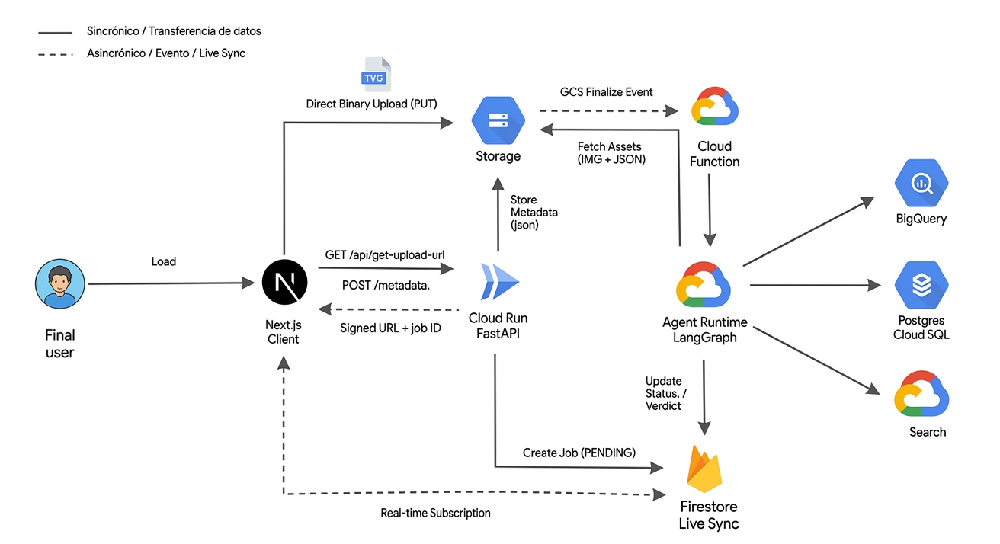
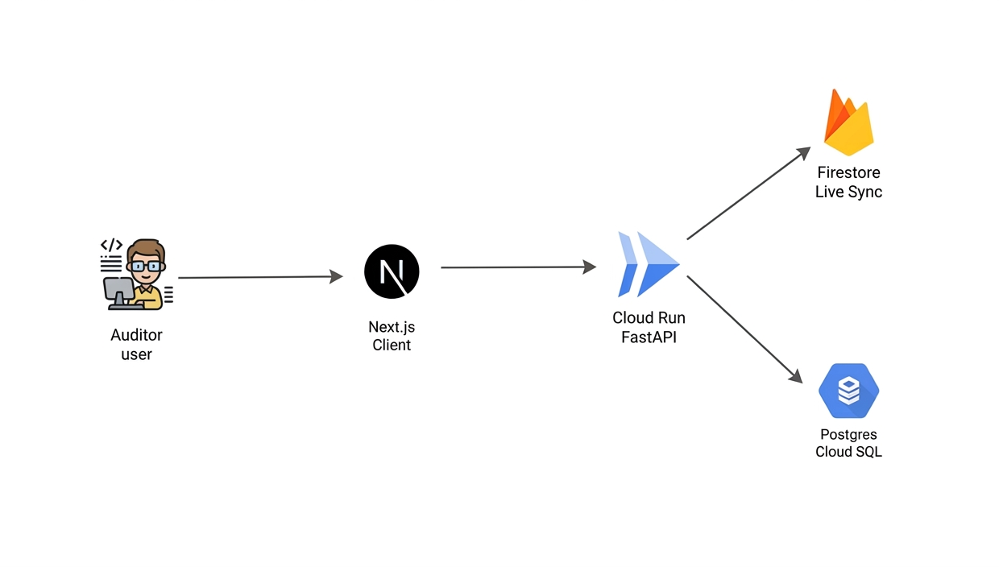

# Hybrid Shield

Production-grade content moderation pipeline for Argentine e-commerce marketplaces. Built with LangGraph + FastAPI + Next.js + GCP.


---

## Demo

End-to-end infrastructure flow, from image upload to the LangGraph agent runtime and its downstream sinks (BigQuery, Cloud SQL, Vertex AI Search):



---

## The problem

E-commerce marketplaces face a constant stream of fraudulent listings: prohibited items, external contact info to bypass payment systems, misleading images, and price manipulation. Manual review doesn't scale, and pure ML classifiers produce false positives that damage seller trust. The cost of a false negative (fraud goes live) is high, but so is the cost of a false positive (legitimate seller blocked).

**Hybrid Shield** solves this with a deterministic + LLM hybrid pipeline that routes cases intelligently: automated approval for low-risk, automated block for policy violations, and human-in-the-loop (HITL) for ambiguous cases. Every decision is explainable and auditable.

---

## Architecture

The moderation pipeline is a **LangGraph state machine** deployed as a Vertex AI Reasoning Engine. It processes product listings (image + metadata) through 8 sequential and conditional nodes:

```
┌─────────────┐
│ pre_filter  │──► Blocks critical violations (text-based safety check)
└──────┬──────┘
       │
       ▼
┌─────────────┐
│  extractor  │──► Multimodal LLM (Gemini 2.5 Flash) extracts features
└──────┬──────┘    from image + metadata
       │
       ├──► Low confidence / ambiguous → HITL
       │
       ├──► Normal flow:
       │    ┌──────────┬─────────────────┐
       │    │   rag    │  risk_evaluator │ (parallel execution)
       │    └────┬─────┴────────┬────────┘
       │         │              │
       │         └──────┬───────┘
       │                ▼
       │         ┌──────────────┐
       │         │   decision   │──► Aggregates signals + risk score
       │         └──────┬───────┘
       │                │
       │                ├──► Approve → fly_wheel (data collection)
       │                ├──► High risk → reasoning (LLM explanation)
       │                └──► Uncertain → reasoning → HITL
       │
       ▼
┌────────────────┐
│ human_review   │◄─► LangGraph interrupt for human validation
└────────┬───────┘
         │
         ▼
┌─────────────┐
│  fly_wheel  │──► Audit log + Firestore state update
└─────────────┘
```

**Why hybrid?** Deterministic rules (regex for banned keywords, price anomaly detection, image quality checks) handle obvious cases with zero latency and cost. The LLM is invoked only when visual analysis or policy matching is needed. This keeps precision high while avoiding unnecessary inference costs.

The HITL auditor dashboard talks to this pipeline over the same Cloud Run API, with Firestore providing live state sync:



**Key architectural decisions:**
- **Stateful checkpointing** via Cloud SQL (Postgres) for crash recovery and HITL resumption
- **Parallel node execution** (RAG + risk evaluator run concurrently via LangGraph fan-out)
- **Conditional routing** based on confidence scores and signal flags
- **Interrupt-based HITL** using LangGraph's native `interrupt_before` mechanism
- **Event-driven orchestration** via Eventarc (GCS file creation triggers Cloud Function → invokes Reasoning Engine)

---

## Tech stack

| Layer                  | Technologies                                                                 |
|------------------------|------------------------------------------------------------------------------|
| **Orchestration**      | LangGraph 1.0.1, LangChain Core 0.3.86, LangGraph Checkpoint Postgres 3.0.5 |
| **Backend API**        | FastAPI 0.136.1, Uvicorn 0.47.0, Pydantic 2.13.4                             |
| **Frontend**           | Next.js 16.1.6, React 19.2.3, TypeScript 5.x, Tailwind CSS 4                 |
| **AI/ML**              | Vertex AI Gemini 2.5 Flash (multimodal), Vertex AI Search (RAG)             |
| **GCP Infrastructure** | Cloud Run, Vertex AI Reasoning Engine, Cloud Functions (2nd gen), Eventarc  |
| **Data Storage**       | Firestore (jobs/state), Cloud SQL Postgres (checkpoints), GCS (images)       |
| **Observability**      | Cloud Logging, OpenTelemetry API, custom trace spans per node                |
| **Testing**            | pytest 8.4.2, pytest-asyncio 1.3.0, Golden Dataset sampling methodology      |

---

## Engineering decisions

### 1. Signals as single source of truth

The `signals` dict in `AgentState` is the **canonical record** of all boolean risk flags (`visual_dissonance`, `contact_info_detected`, `price_anomaly`, etc.). Nodes populate signals, but never interpret them directly—interpretation happens in `decision_node` via weighted risk aggregation defined in `constants.py`:

```python
RISK_WEIGHTS = {
    "banned_object": 1.0,          # instant block
    "external_contact": 1.0,       # instant block
    "unverifiable_image": 0.40,    # forces HITL alone
    "visual_dissonance": 0.25,     # suspicious but not definitive
    "price_anomaly": 0.25,         # context-dependent
    # ...
}
```

**Why this matters:** Changing moderation policy (e.g., making price anomalies more aggressive) requires editing one dict, not hunting through multiple node implementations. This enables rapid A/B testing of risk thresholds.

### 2. Dynamic model selection with cost tracking

The `ai_service.py` module abstracts Gemini invocations behind a `GenAIModelInterface`. Each call returns structured usage metadata:

```python
{
    "data": {...},  # parsed response
    "usage": {
        "prompt_tokens": 1234,
        "candidates_tokens": 567,
        "model_name": "gemini-2.5-flash-lite"
    }
}
```

Nodes merge usage into `execution_metrics` using a **custom reducer** (`merge_metrics` in `state.py`) that aggregates token counts per node. The evaluation framework (`moderator_balancer_evals.py`) uses this to calculate **per-item and per-node costs** in real-time, enabling cost-driven model selection (e.g., downgrade to Flash Lite when precision target is met).

### 3. Human-in-the-loop with interrupt + resume

LangGraph compiles the graph with `interrupt_before=["human_in_the_loop"]`. When a case routes to HITL:

1. Execution **pauses** and persists state to Cloud SQL checkpoint
2. Firestore status updates to `PENDING_HUMAN_REVIEW`
3. Frontend polls `/api/jobs/{thread_id}` and displays the audit trace via `/api/audit/trace/{thread_id}`
4. Auditor submits decision (`Approve` / `Block` + justification) via `/api/jobs/{thread_id}/resume`
5. `audit_service.resume_graph_execution()` injects the decision using `Command(resume=...)` and re-invokes the graph
6. Graph resumes from `human_review` node, routes to `fly_wheel`, and completes

**Why Command pattern?** LangGraph's `Command` API allows **mid-execution state injection** without reconstructing the entire graph or losing checkpoint history. This enables auditable HITL with full trace preservation.

### 4. Fire-and-forget Firestore updates

Every node performs Firestore status updates via `asyncio.create_task()` (fire-and-forget pattern):

```python
async def safe_status_update():
    try:
        await firestore_service.update_job_status(thread_id, "ANALYZING_IMAGE")
    except Exception as e:
        logger.error(f"Non-blocking error: {e}")

asyncio.create_task(safe_status_update())
# Node continues immediately without awaiting Firestore response
```

**Why this matters:** Firestore writes have 50-100ms latency. Awaiting them sequentially would add 400-800ms to the critical path. Fire-and-forget keeps UI updates responsive while preventing Firestore failures from crashing the graph.

---

## Environment configuration

Both apps ship a `.env.example` with every variable the code actually reads (verified against the source, not aspirational). Copy it and fill in real values — never commit the resulting `.env*` files (already gitignored).

```bash
# Backend
cd backend && cp .env.example .env

# Frontend
cd frontend && cp .env.example .env.local
```

### Modes

| Mode | How to run | What it needs |
|------|-----------|----------------|
| **Mock** | `npm run dev:mock` (frontend only) | Nothing — no GCP project, no backend, no credentials. Uses static data in `lib/mock/`. |
| **Local dev** | `uvicorn main:app --reload` (backend) + `npm run dev` (frontend) | Full `backend/.env`, a running Cloud SQL Proxy, `gcloud auth application-default login`, and `LOCAL_DEV=true` so the backend impersonates a service account to sign GCS URLs. |
| **Production** | Cloud Run (backend) + Vercel (frontend) | Same variables as local dev, minus `LOCAL_DEV` (the Cloud Run service account is used natively) and impersonation. |

### Key variables (backend)

All env reads are centralized in [`backend/config.py`](backend/config.py) — plain functions (not a class/singleton, see the module docstring for why: the Vertex AI Reasoning Engine deployment injects credentials at runtime, after import, which rules out anything eagerly evaluated at import time).

| Variable | Required | Notes |
|---|---|---|
| `GOOGLE_CLOUD_PROJECT` | ✅ | GCP project ID |
| `GOOGLE_CLOUD_LOCATION` | ✅ | Vertex AI region for Gemini/Search (e.g. `us-central1`, can be `global`) |
| `DB_CONNECTION_NAME` | ✅ | `project:region:instance` — single source of truth for the Cloud SQL checkpointer, used by both `graph.py` and `audit_service.py` |
| `DB_USER` / `DB_PASS` | ✅ | Cloud SQL credentials |
| `DATA_STORE_ID` / `ENGINE_ID` | ✅ | Vertex AI Search (RAG) data store |
| `GCS_BUCKET_NAME` | ✅ | Bucket used by the upload/moderation API (`main.py`) **and** for building public image URLs (`firestore_service.py`) |
| `GOOGLE_CLOUD_BUCKET` | ⚠️ eval-only | Separate bucket used only by the golden-dataset eval script — **not** the same as `GCS_BUCKET_NAME` |
| `FIRESTORE_PROJECT_ID` / `FIRESTORE_DATABASE_ID` | Optional | Override the Firestore project/database (defaults match the project's actual setup) |
| `LOCAL_DEV` / `SERVICE_ACCOUNT_EMAIL` | Local only | Needed to generate signed upload URLs from a developer machine |
| `REASONING_ENGINE_ID` / `REASONING_ENGINE_LOCATION` | Deploy scripts only | Used by `re_deploy_reasoning_engine.py`, `delete_reasoning_instance.py`, `test_reasoning_engine.py` |
| `ALLOWED_ORIGINS` | Recommended | CORS allowlist; defaults to `*` if unset |

See `backend/.env.example` for the full list with inline explanations.

> **Note on `GCS_BUCKET_NAME`:** before this cleanup, `main.py` and `firestore_service.py` each hardcoded a *different* bucket name as their fallback default. They now read the same `GCS_BUCKET_NAME` variable, defaulting to `ecommerce-police-media-uploads` (the value seen in a real GCS URI elsewhere in the repo). **Verify this matches your actual bucket** — set `GCS_BUCKET_NAME` explicitly in Cloud Run's env vars if not.

### Key variables (frontend)

| Variable | Required | Notes |
|---|---|---|
| `NEXT_PUBLIC_DATA_SOURCE` | — | Set to `mock` to bypass GCP entirely |
| `NEXT_PUBLIC_API_URL` | ✅ (non-mock) | FastAPI backend base URL |
| `NEXT_PUBLIC_STORAGE_STRATEGY` | ✅ (non-mock) | `signed_url` (default) or `local` |
| `NEXT_PUBLIC_FIREBASE_*` (6 vars) | ✅ (non-mock) | From Firebase Console; without these the app silently falls back to non-functional mock values |

See `frontend/.env.example` for the full list.

---

## Testing and evaluation

### Evaluation framework

The system uses a **Golden Dataset** methodology implemented in `backend/tests/evals/moderator_balancer_evals.py`:

- **Dataset tiers**: `balanced` (production-representative mix), `tier1_smoke_test` (critical cases), `tier2_precision`, `tier3_recall`
- **Sampling strategy**: Stratified sampling by category + label to prevent class imbalance
- **Metrics tracked**: Precision, Recall, F1, Automation Rate (% auto-approved + auto-blocked), Error Rate, P95 latency
- **Cost accounting**: Per-item and per-node token usage → USD cost at Gemini Flash Lite pricing ($0.25/M input, $1.50/M output)
- **Failure isolation**: Failed cases (FP/FN) auto-copied to `results/{tier}/no-pasaron/` with metadata for debugging

### Threshold enforcement

```python
MIN_PRECISION       = 0.85    # ≥85% of blocks must be correct
MIN_RECALL          = 0.90    # ≥90% of actual fraud must be caught
MIN_F1              = 0.87    # Balanced F1 score
MAX_ERROR_RATE      = 0.05    # <5% technical failures
MAX_P95_LATENCY_MS  = 36000   # P95 under 36s (includes HITL timeout)
MIN_AUTOMATION_RATE = 0.80    # ≥80% cases resolved without human
```

Evals generate:
- Markdown report with confusion matrix + per-node latency breakdown
- PNG plots (confusion matrix, latency distribution, node performance)
- JSON export for CI integration

### Test coverage

- **Integration tests**: Full graph execution with mocked GCS/Firestore (`backend/tests/integration/graph/`)
- **Node tests**: Unit tests per node with VCR.py for Gemini response replay (`backend/tests/integration/nodes/`)
- **API tests**: FastAPI endpoint testing (`backend/tests/integration/apis/`)
- **Test fixtures**: `conftest.py` provides reusable fixtures for async graphs and mock states

**Note**: No formal % coverage metric in current state. Eval framework provides **functional regression detection** via golden dataset rather than line coverage.

---

## Local setup

### Prerequisites

- Python 3.12+ (backend), Node.js 20+ (frontend)
- Google Cloud SDK with active project
- Service account key with roles: `Vertex AI User`, `Firestore User`, `Storage Object Admin`, `Cloud SQL Client`

### Backend

```bash
cd backend

# Create virtual environment
uv venv
source .venv/bin/activate  # Windows: .venv\Scripts\activate

# Install dependencies
uv pip install -r requirements.txt

# Configure environment (copy and fill in real values)
cp .env.example .env
# Edit .env with your GCP project ID, DB connection name, etc.

# Run local dev server (requires Cloud SQL Proxy running)
uvicorn main:app --reload --port 8000
```

**For Cloud SQL Proxy** (required for local Postgres checkpoint access):
```bash
# Download the binary for your OS from:
# https://cloud.google.com/sql/docs/postgres/connect-admin-proxy
# (not vendored in this repo — it's a large per-OS executable)

# Run proxy in separate terminal:
cloud-sql-proxy <PROJECT_ID>:<REGION>:<INSTANCE_NAME> --port 5432
```

### Frontend

```bash
cd frontend

# Install dependencies
npm install

# Run dev server
npm run dev          # Full GCP integration mode
npm run dev:mock     # Mock mode (static data, no GCP calls)
```

Access at `http://localhost:3000`

### Run evaluations

```bash
cd backend
python -m tests.evals.moderator_balancer_evals

# Specify tier:
python -m tests.evals.moderator_balancer_evals --tier balanced
```

Results saved to `backend/tests/evals/results/{tier}/run_{timestamp}/`

---

## Project structure

```
├── backend/
│   ├── agents/moderator/       # LangGraph agent implementation
│   │   ├── graph.py            # Graph compilation + Reasoning Engine wrapper
│   │   ├── nodes.py            # Node implementations (8 nodes)
│   │   ├── state.py            # AgentState TypedDict + custom reducers
│   │   ├── schemas.py          # Pydantic models for structured outputs
│   │   ├── constants.py        # RISK_WEIGHTS configuration
│   │   ├── services/           # External service integrations
│   │   │   ├── ai_service.py   # Gemini API abstraction
│   │   │   ├── rag_service.py  # Vertex AI Search client
│   │   │   ├── firestore_service.py  # Firestore job state management
│   │   │   └── audit_service.py      # Checkpoint history + HITL resume
│   │   └── prompts/            # LLM prompt templates
│   ├── deploy/                 # Vertex AI Reasoning Engine deployment scripts
│   ├── tests/
│   │   ├── evals/              # Golden Dataset evaluation framework
│   │   └── integration/        # Pytest integration tests
│   ├── main.py                 # FastAPI application
│   └── requirements.txt        # Python dependencies
│
├── frontend/
│   ├── app/                    # Next.js 16 App Router
│   │   ├── page.tsx            # Submission form (upload + metadata)
│   │   └── hitl/page.tsx       # HITL auditor dashboard
│   ├── components/             # React components
│   └── lib/                    # API client + state management (Zustand)
│
├── services/
│   └── processor_func/         # Cloud Function (Eventarc trigger)
│       └── main.py             # Image optimization + Reasoning Engine invocation
│
├── shared/
│   └── image_utils.py          # WebP optimization (PIL-based)
│
└── data/
    ├── policies/               # Policy documents for RAG ingestion
    ├── balanced/               # Golden Dataset (production-representative)
    └── evals/                  # Tiered evaluation subsets
```

---

## Roadmap and known limitations

**Production-ready components:**
- ✅ Full graph execution with checkpoint persistence
- ✅ HITL interrupt + resume mechanism
- ✅ Cost tracking + token usage observability
- ✅ Eventarc-based async orchestration
- ✅ Evaluation framework with stratified sampling

**Deliberate simplifications (portfolio scope):**
- ⚠️ **No batch processing**: Currently 1 listing per invocation. Production would use batching for cost optimization.
- ⚠️ **Fixed risk thresholds**: `RISK_WEIGHTS` are hardcoded. Production would load from Firestore for dynamic A/B testing.
- ⚠️ **No model versioning**: Single Gemini model. Production would use model registry + shadow deployments.
- ⚠️ **Price thresholds**: Stored in Firestore but manually seeded. Production would integrate with dynamic market data.
- ⚠️ **English code, Spanish outputs**: Internal code in English, user-facing explanations in Spanish (Argentine marketplace context).
- ⚠️ **No CI/CD**: Manual deployment via `deploy_reasoning_engine.py`. Production would use Cloud Build + automated evals.

**Future enhancements:**
- [ ] Real-time policy update pipeline (ingest new PDFs → auto-reindex in Vertex AI Search)
- [ ] Confidence calibration analysis (histogram of prediction confidence vs actual correctness)
- [ ] Multi-region deployment for latency optimization
- [ ] Feedback loop: auditor corrections → fine-tuning dataset
- [ ] Active learning: prioritize HITL on high-uncertainty cases

---

## Contact

**Repo**: [github.com/catrielramirez/hybrid-shield](https://github.com/catrielramirez/hybrid-shield)

---

**License**: MIT

Built as a portfolio project demonstrating production-grade AI engineering: state machine orchestration, cost-aware model selection, explainable decisions, and rigorous evaluation methodology.
